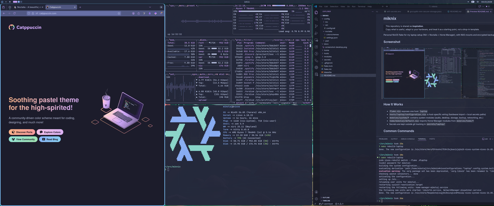

# miknix

> This repository is shared as **inspiration**.  
> Copy what is useful, adapt to your hardware, and treat it as a starting point, not a drop-in template.

Personal NixOS flake for my laptop setup (Niri + Noctalia + Home Manager), with NAS mounts and encrypted backups.

## Screenshot



## How It Works

- `flake.nix` exposes one host: `laptop`
- `hosts/laptop/configuration.nix` is host-specific wiring (hardware import + local secrets dir + host module imports)
- `modules/system/*` contains reusable system modules (audio, desktop, networking, etc.)
- `hosts/laptop/storage.nix` contains laptop-specific mounts and encrypted mount wiring
- `hosts/laptop/backup.nix` contains laptop backup policy (paths, schedules, retention)
- `home/default.nix` imports Home Manager modules from `modules/home/*`
- Runtime secrets are read from `miknix.secretsDir` (on laptop: `$HOME/data/nix_secrets/laptop`)

## Config Overrides

Configs are layered by user:

- `config/default/...` contains shared defaults
- `config/<username>/...` overrides defaults when a matching file exists

Current modules using this fallback pattern include: Niri, Noctalia, Kitty color sync source, Midnight Commander, and Yazi.

Example: to override Niri only for user `alice`, create:

```text
config/alice/niri/config.kdl
```

Everything else still falls back to `config/default/...`.

## Guides

- [Add or change primary user](./docs/guide-add-user.md)
- [Add a new host and compose modules](./docs/guide-add-host.md)

## Common Commands

Rebuild laptop:

```bash
sudo nixos-rebuild switch --flake .#laptop
```

Update flake inputs:

```bash
nix flake update
```

Or via Makefile:

```bash
make rebuild-laptop
make flake-update
```

## Host Secrets

See `hosts/laptop/SECRETS.md` for laptop-specific secret setup.

## Notes

- Bootstrap user password is intentionally **not** stored in repo.
- After fresh install, set password manually:

```bash
nixos-enter --root /mnt
passwd <username>
```
- If `nixos-rebuild` reports missing module paths, make sure newly created files are tracked (`git add ...`) because flakes read from Git snapshot.
